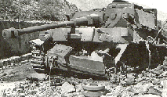

This shiny app is for simulating and comparing different answers for German Tank Problem. 

- App is here: https://ristohinno.shinyapps.io/GermanTankProblemApp/

- First version with ggplot graphs: https://ristohinno.shinyapps.io/GermanTankProblem/

- Slides for explaining app is here: http://rpubs.com/RRisto/69719

- Article about the solutions: http://rpubs.com/RRisto/59464

- Wikipedia article about the original problem and solution: https://en.wikipedia.org/wiki/German_tank_problem

- This kind of simulation could be used solving other problems where population size must be guessed based on sequential serial numbers captured.

Have a nice tank hunt!

